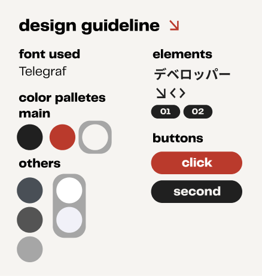
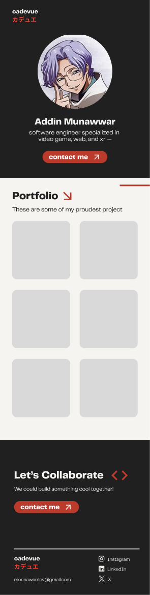

It's initiated during the winter holiday, just like how any of hobby projects started. I was in my 4th year of college, waiting for my last semester to come, while daunted by the fact that I will have to enter the CS job market after all of this is over. But it's not just about entering the job market. No, it's about entering the **CS job market in 2025**. Yes, entering the CS job market in 2025, you heard it right. You know how cooked it is. Even the chance of ... is much higher than a computer science graduate getting a job.

So there it is, *I'm basically cooked*. &nbsp;Unless, that makes me think, "What should I do to make all of these life phase much smoother?". I got a decent grade in college, which I think is the big asset for me, but that alone is not enough. I have much passion and love in programming, truly, that I would really like to show. The problem is, there's no way they (my future employer) would know that. I have to make myself visible. Well, you can (obviously) tell them what project you've worked on, your experience, and anything else during interview, or maybe just put it in the CV. But no no no, that's what everyone will do.

So, I think my path is clear here: **Making a portfolio website**
<br><br>

## Building the Website
### The Design
The goal of the website is initially one thing: shows my portfolio. The first thing I want people to immediately see is just my projects. So, I didn't think too much. I immediately hopped on Figma and starts to get anything going. For the design, I did some research. I use canva and scroll through their presentation templates until I see what I like. I pick a template I like and start replicating it in Figma, play with the colors and layouts a bit to create a unique style that works for me. I created a simple design guideline that I will follow to design the whole website. This is the design guideline I come up with.
<br> <br>
<div class="flex flex-col items-center gap-1">



<br>
<span class="text-sm sm:text-base italic">Design Guideline for cadevue.com</span>
</div>
<br>

I already get the rough idea of the website. Basically, I should have a hero section, projects, and contact. I want it to be very simple. I don't starts from low fidelity, which what they thought you should do, and probably what you should do in some cases. However, for such a simple website such mine, I don't think there's really need for that, especially since I work on this project alone. 

What I did though, is following the mobile-first design approach. I think. it's a really good practice, because it's much easier to create a desktop design based on mobile design, rather than the opposite. I also use some japanese characters (katakana), because it fits the aesthetic well. Here's the design I come up with. Pretty neat I think.
<br> <br>
<div class="flex flex-col items-center gap-1">



<br>
<span class="text-sm sm:text-base italic">The Mobile Design of cadevue.com</span>
</div>
<br>

### Development
Design done! Let's get into development. Picking up a tech stack was not a big problem for me, because I have laid eyes for quite sometimes on **Astro** and **Svelte**. And I think it's a perfect time to try them out, while building my portfolio website.

Astro is a static site generator that can generate static sites from predefined html layout, and shipping it with minimal to no javascript. Astro also uses Vite in the background, which I think is the best build tools in the market right now. The thing I like the most about astro is probably its content management with Markdown. Astro allows you to write markdown and use it as a content for your website. This article, is actually written in markdown. This makes it very easy to write contents. I use it to write my project and article collections.

Svelte on the other hand is quite useful for handling interactive components, which I use in some of my pages. Astro allows the usage of Svelte component (and many other component from popular frameworks) inside Astro, so if I need interactivity, I can just use Svelte Component. They achieve this with what they called an [island architecture](https://docs.astro.build/en/concepts/islands/), where each component run in different context and will be loaded based on some rules. The use case of this is in my [projects page](/projects), where I use Svelte to create a filterable project list. 

The choice of Svelte over other framework is mostly just because it's one of the popular framework I haven't tried yet. Svelte also considered one of the best at performance, because it doesn't ship with a runtime library. Instead, Svelte compile/transpile the code to vanilla javascript, making the bundle size very small. For styling, I stick with Tailwind, because I'm too comfortable with it.
<br>

### Deployment
There are a lot of options when it comes to deploying a static sites, such as Netlify, Vercel, Github Pages, and Cloudflare. In my opinion, it doesn't really matter which one I pick, but I ended up using Cloudflare. It's my first time as well using it, and so far I had no issues with it. It has some nice features, such as distributed caching, image optimization, ddos protection, and many more. So why not use it? It's also free, so that's a plus. I also bought my domain in Cloudflare.

### Optimization
First of all, I think the choice of framework and tools I use is already a good optimization. Astro and Svelte are already optimized for performance out of the box for the reasons I've mentioned above, and some other reason to follow. 

Astro is defaulted to ship no javascript. When needed, the javascript can be loaded lazily based on some rules. In my case, the rule is to load the javascript only when the element that uses it is in the viewport. Not only that, the javascript used is relatively small in size, because it's compiled to vanilla javascript by Svelte. Astro also handles memoization of javascript, so the javascript is only loaded once, and will not be loaded again when the user navigates to another page.

Next, Astro also can prefetch the page that the user will likely to visit next. I use this feature all over my website. For the most part, the page will be fetched whenever the user hover over the link, so when the user actually click the link, the page is already there. For SEO, Astro also has a built-in sitemap generator. I can then submit the sitemap to google search console, so my website will be indexed by google.

What about the image? Image is probably the largest file loaded in the website right? Well, guess what. Astro has got you covered once more. Well, this is probably part of the benefit of using Vite as well. Basically, every imported image will be optimized by Vite into a modern webp format. But, I actually got some issue with this. The built-in image optimization can't be used inside the Svelte component, so my solution is to host it in ImageKit. ImageKit also provides the transformation API as well, so I can resize the image based on the screen size. Here's an example of how I use it in my project page.

```html

```
There's probably a better workaround to use Astro built-in image optimization inside Svelte component, but I haven't found it yet.

Okay, enough with the Astro-Svelte glaze, let's just see the result. With all of the techniques mentioned above, we can get a lighthouse as score of 100 on every aspect, both for mobile and desktop!
<br><br>

## Filling up the portfolio
So the website is done, I just have to put all my projects in, right? Well, that's until I realize that my portfolio isn't actually that interesting. I could argue with myself, just don't be a perfectionist and just dump all my github repository to the website. But, It's not that simple. My portfolio is a sacred thing for me, and I want it to be displayed in the best condition as possible.

Well, that's another story for another article, which i will probably published just right after this. It might have been out, so check it out after you done!
<br><br>
