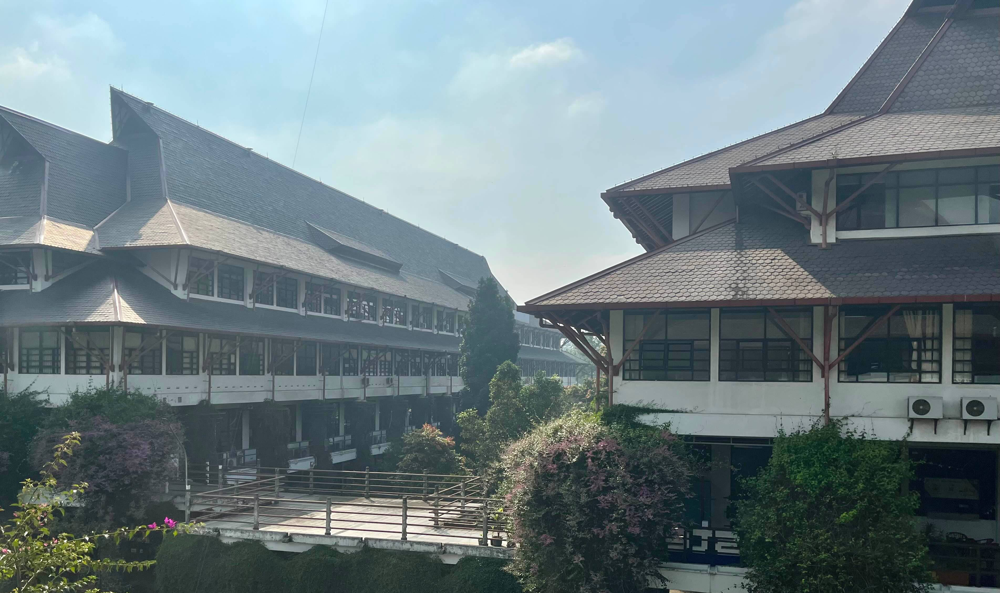
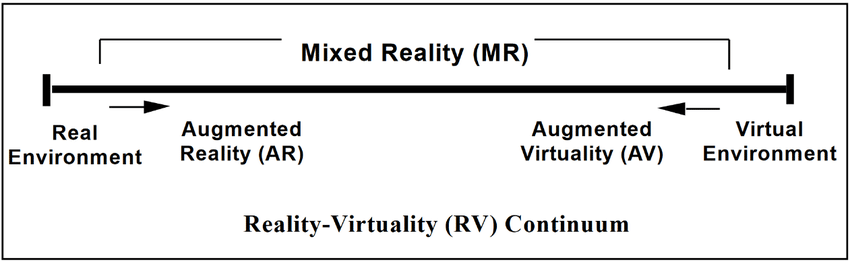
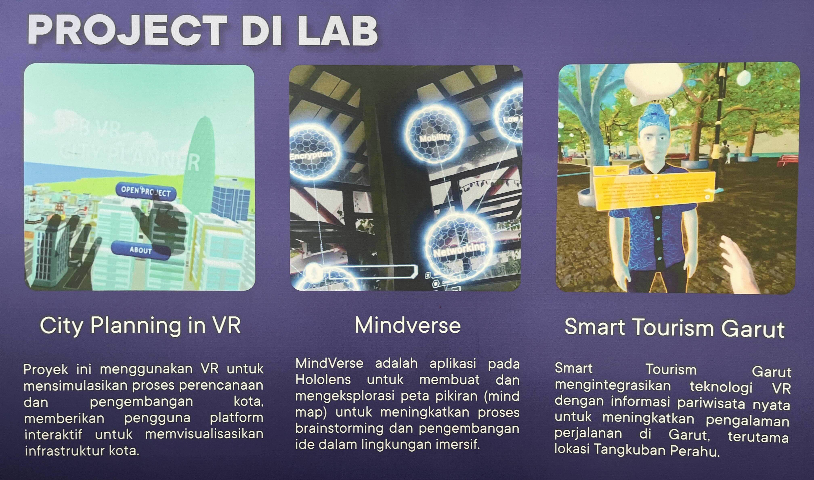
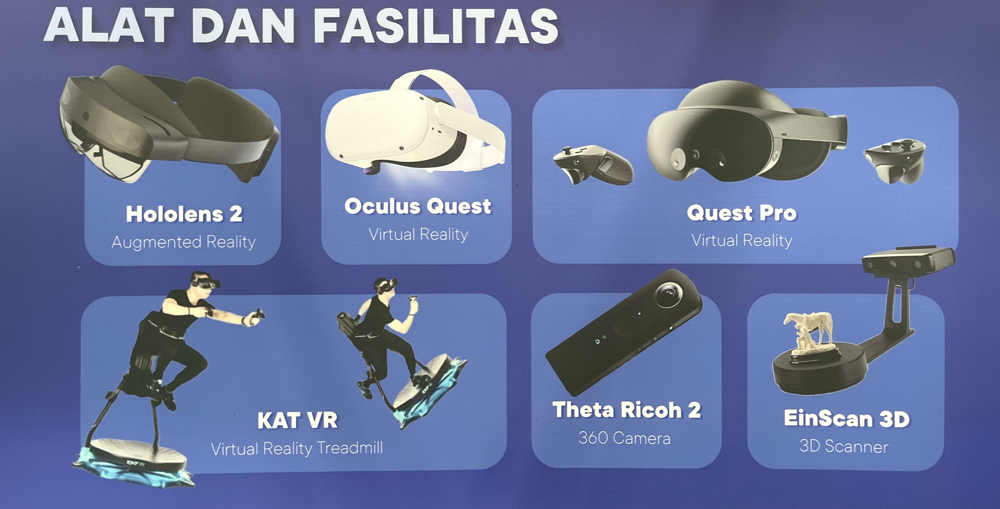

Ditulis oleh Addin Munawwar (13521085) dan Yandi Ghassani Septiandi (10321021)

Digital Reality adalah konsep teknologi yang menggabungkan dunia digital/virtual dan dengan dunia untuk menciptakan pengalaman yang imersif. ITB memiliki Lab Metaverse yang berfokus pada penelitian dan pengembangan teknologi digital reality. Dalam rangkaian kuliah IF4063 Gim dan Realitas Digital, beberapa minggu lalu, kami mengunjungi lab metaverse ITB untuk mendapatkan exposure terhadap alat-alat, penelitian, serta pengembangan yang dilakukan di lab tersebut.

## The Landscape of Digital Reality
Digital Reality mencakup berbagai teknologi yang memungkinkan interaksi antara dunia digital dan fisik. Hal Ini termasuk Virtual Reality (VR), Augmented Reality (AR), dan teknologi terkait lainnya. Teknologi-teknologi ini berada di dalam sebuah spektrum/continuum, di mana di satu sisi ada dunia digital murni (seperti game komputer), dan di sisi lain ada dunia fisik murni (seperti realitas yang kita alami sehari-hari). Digital Reality berusaha untuk menggabungkan kedua dunia ini, menciptakan pengalaman yang lebih kaya dan interaktif.

Reality-Virtuality Continuum oleh Paul Milgram

Aplikasi Digital Reality sangat luas, mulai dari gim, pendidikan, pelatihan industri, aplikasi medis, bahkan militer. Di ITB, Lab Metaverse telah melakukan beberapa penelitian dan pengembangan proyek dalam bidang ini. Beberapa proyek yang telah dilakukan antara lain City Planning in VR (Pemodelan Kota), Mindverse (Pendidikan), dan Smart Tourism Garut (Pariwisata).

Proyek di Lab Metaverse

Akan tetapi, Digital Reality masih memiliki tantangan untuk diadopsi secara luas. Beberapa tantangan tersebut antara lain adalah biaya, keamanan saat menggunakan alat-alat Digital Reality, dan masalah privasi. Selain itu, ada juga tantangan dalam hal operabilitas dari alat-alat ini, yang dapat mengganggu pengalaman pengguna.

## Alat-alat di Lab Metaverse ITB

Alat-alat di Lab Metaverse

Beberapa alat yang ada di Lab Metaverse ITB antara lain:
- **Oculus Quest dan Pro** 
Headset Virtual Reality (VR) yang memungkinkan pengguna untuk merasakan pengalaman virtual reality. Memiliki fitur inside-out tracking untuk melacak posisi pengguna tanpa perlu sensor eksternal. Menggunakan interface berupa controller, hand-tracking, dan voice command. Memiliki fitur passthrough mode untuk melihat dunia nyata di sekitar pengguna.
- **KAT VR** 
Alat berupa treadmill yang memungkinkan perangkat untuk melacak gerakan pengguna dalam ruang virtual. Terdapat head-mounted display (HMD) yang digunakan untuk melihat dunia virtual serta melacak gerakan kepala pengguna. Alat ini juga dapat mendeteksi orientasi pinggang pengguna dan mendeteksi lompatan. Selain itu, gerakan kaki pengguna juga dapat dideteksi, sehingga pengguna dapat berjalan, berlari, atau melompat dalam dunia virtual. Controller juga digunakan untuk berinteraksi dengan objek dalam dunia virtual, serta pelacakan gerakan tangan pengguna.
- **HoloLens 2** 
Smart Augmented Reality (AR) glasses yang memungkinkan pengguna untuk melihat dunia digital yang terintegrasi dengan dunia nyata. Berjalan pada sistem operasi Windows Holographic (variasi dari Windows 10). Memiliki fitur hand-tracking, eye-tracking, dan voice command.
- **Theta Ricoh 2** 
Alat untuk menangkap video dan foto dalam format 360 derajat.
- **EinScan 3D** 
Alat untuk menangkap objek fisik ke dalam format objek 3D virtual.
- **Wacom One** 
Alat berupa tablet grafis yang memungkinkan pengguna untuk menggambar atau menulis untuk membuat konten digital.

## Bagaimana Alat-alat ini bekerja?
Pada dasarnya, alat-alat ini memiliki 3 komponen pembangun: Display/HMD, Sensor/Tracking, dan Input. Display atau Head-Mounted Display (HMD) adalah alat yang digunakan untuk menampilkan dunia virtual kepada pengguna. Sensor atau tracking adalah alat yang digunakan untuk melacak posisi dan gerakan pengguna dalam dunia virtual. Input adalah alat yang digunakan untuk berinteraksi dengan dunia virtual, seperti controller, hand-tracking, atau voice command.

### Display
Jenis display yang paling umum digunakan adalah Head-Mounted Display (HMD), yang merupakan headset yang dikenakan di kepala pengguna. HMD ini memiliki layar di dalamnya yang menampilkan dunia virtual, serta lensa untuk memperbesar tampilan tersebut. Prinsip kerja HMD mirip dengan kacamata 3D, dimana masing-masing mata pengguna melihat gambar yang sedikit berbeda, sehingga memberikan kesan depth atau 3D pada dunia virtual.

### Sensor
Alat-alat ini dilengkapi dengan banyak sensor, yang fungsinya juga sangat bermacam-macam. Pada Meta Quest Pro saja misalnya, terdapat 5 kamera (4 tracking, 1 depth) untuk melakukan inside-out tracking, yaitu melacak lingkungan sekitar, posisi headset, dan posisi tangan pengguna. Selain itu, terdapat juga sensor IMU (Inertial Measurement Unit) berupa accelerometer dan gyroscope yang digunakan untuk melacak posisi dan gerakan headset. Alat ini juga memiliki sensor untuk eye-tracking, yang digunakan untuk melacak gerakan mata pengguna, untuk keperluan seperti foveated rendering, avatar eye movement, dan lain-lain. Keseluruhan sensor ini bekerja sama sebagai satu sistem untuk memberikan pengalaman yang imersif kepada pengguna.

### Input
Input pada alat-alat ini juga bervariasi, mulai dari controller, hand-tracking, hingga voice command.
 

Berikutnya, kami juga menulis artikel tentang bagaimana cara mengimplementasikan hand-tracking di Unity menggunakan Meta Quest Pro. Anda dapat membaca artikel tersebut [di sini](https://www.cadevue.com/article/unity-tutorial-hand-tracking-meta-quest-pro).