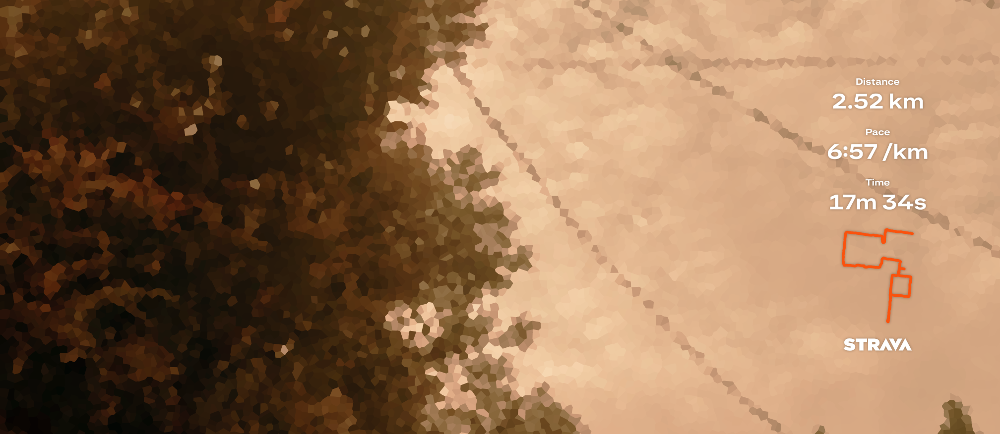

<i> to all the dreams that seem blurry. imagined while running. </i>

dear friend, 
how excited we were upon the clouds  
said we'd jet through them and build a castle 
not today, but it's okay  
as long as we're sustainable 

dear friend, 
do you remember about the stars 
said we'd gleam so bright and steal their shine 
maybe tomorrow, but it's okay 
as long as we're sustainable 

dear friend, 
we mused about crossing the ocean 
said we'd conquer the tides and catch every fish 
not easy, but it's okay 
as long as we're sustainable 

dear love, 
this morning I saw clouds crumble in raging gray 
the stars' shine couldn't reach my lingering fog 
the dark ocean climbed and swallowed my face 

i took a ~wrong~ different path 
what a waste 
i'm no longer sustainable
