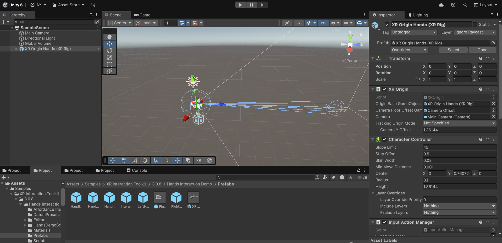

<span class="text-sm sm:text-base italic">Image from Unity XR Hands documentation</span>

<p class="text-gray-400">Written by Addin Munawwar (13521085) and Yandi Ghassani Septiandi (10321021)<p>

In this tutorial, we will explore how to implement hand tracking in Unity. This tutorial will use Unity 6000.0.39f1, but any version of Unity 2023.3 or later should work.

## Setting-Up the Project
To get started with hand tracking in Unity, you need to configure your Unity project correctly. Follow these steps to ensure your project is ready for VR hand interactions.

### Install Unity Android Module
Make sure you have the Android Build Support module installed already. If you haven't installed it, or not sure, follow these steps:
1. Open Unity Hub.
2. Click on the "Installs" tab.
3. Click on the gear icon next to your Unity version and select "Add Modules".
4. Check Android Build Support, Android SDK & NDK Tools, and OpenJDK.
5. Click "Done" to install the modules.

If you have already installed the Android Build Support module, it would look like this


### Create a New URP Project
To create a new project with the Universal Render Pipeline (URP), open the Unity Hub and select "New Project". Choose the "Universal Render Pipeline" template, name your project (e.g., "HandTracking"), and click "Create".


### Install XR Plugin Management
Go to `Edit > Project Settings`, then select `XR Plugin Management` from the left sidebar. Click on the "Install XR Plugin Management" button. This will install the necessary packages for XR development.


Then, select the "OpenXR" option under the XR Plugin Management settings. This will enable OpenXR support for the project.


If there is a warning symbol next to OpenXR, click on it to open the Project Validation window. This will help you identify any issues with the OpenXR setup. There is a "Fix All" button that will automatically resolve common issues.


The remaining issues should be resolved manually. The common issues include:
- Neeed at least one interaction profile for the OpenXR runtime: Will be discussed in next.
- Space Screen Ambient Occlusion not suitable for VR: Remove SSAO Renderer Feature from the URP Setting Asset (Do your research on this).

### Add Interaction Profiles and OpenXR Features
To add interaction profiles and OpenXR features for the OpenXR runtime, go to `Edit > Project Settings`, then select `XR Plugin Management` from the left sidebar. Under the OpenXR section, click on "Interaction Profiles". Add the following interaction profiles and OpenXR features


### Install XR Interaction Toolkit
To install the XR Interaction Toolkit, go to `Window > Package Manager`. In the Package Manager window, search for "XR Interaction Toolkit" under Unity Registry and click on "Install". This toolkit provides the necessary components for XR interactions, including hand tracking.


### Import Starter Assets and Hands Interaction Demo
Under XR Interaction Toolkit Package, click on the "Samples" tab, then find the "Starter Assets" and "Hands Interaction Demo" sample. Click on "Import" to add both sample to your project. This sample provides a basic setup for hand tracking and interactions.


## Implement Hand Tracking
First, find the "XR Origin Hands (XR Rig)" prefab in the Project window under `Assets > Samples > XR Interaction Toolkit > Hands Interaction Demo > Prefabs`. Drag and drop this prefab into your scene. This prefab contains the necessary components for hand tracking, including the XR Origin and hand models.



To track the hand position, we can use the XR Interaction Toolkit API provided by Unity. This simple script will follow the position of the user's right hand's wrist and move the target transform in front of the user's hand.

```csharp
public class AttachToXRHand : MonoBehaviour
{
    private XRHandSubsystem _handSubsystem;
    public Transform _targetTransform;
    public float _forwardOffset = 1f;
    public LineRenderer _lineRenderer;
    
    private void Start()
    {
        _handSubsystem = XRGeneralSettings.Instance.Manager.activeLoader.GetLoadedSubsystem<XRHandSubsystem>();
    }

    private void Update()
    {
        if (_handSubsystem == null)
            return;

        XRHand rightHand = _handSubsystem.rightHand;

        if (rightHand.isTracked)
        {
            XRHandJoint wrist = rightHand.GetJoint(XRHandJointID.Wrist);
            if (wrist != null && wrist.TryGetPose(out Pose wristPose))
            {
                _targetTransform.position = wristPose.position + wristPose.forward * _forwardOffset;

                if (_lineRenderer != null)
                {
                    _lineRenderer.SetPosition(0, wristPose.position);
                    _lineRenderer.SetPosition(1, _targetTransform.position);
                }
            }
        }
    }
}
```

An example implementation of this is to move a Robot Claw to move towards a target in front of the user's hand. This would involve implementing an IK (Inverse Kinematics) system to control the claw's movement based on the hand's position and orientation, which is beyond the scope of this tutorial. However, you can find many resources online that explain how to implement IK in Unity.


After this, you can add the `AttachToXRHand` script to a GameObject and assign the target transform and line renderer in the Inspector.

## Conclusion
In this tutorial, we have covered the basic setup for hand tracking in Unity. We have installed the necessary packages, configured the project settings, and implemented a simple hand tracking script. You can now use this setup to create interactive VR experiences that utilize hand tracking.