Github Repository:  
https://github.com/cadevue/IF3210-2024-Android-SLP
 

# Description 👨‍💻
Bondoman is a transaction management application that allows users to add, edit, and delete transaction records.
Each transaction has attributes: title, price, date, category ("Income" or "Expense"), and location.

The location updates automatically when the app is opened, but users can manually change it when adding or editing a transaction. Users can also open the location directly in Google Maps.

The app supports scanning receipts through the camera or gallery. Scanned receipts generate dummy transaction data that is added to the transaction list.
A chart displays the proportion of transactions by category.

Users can:
- Export the transaction list as an XLS/XLSX file,
- Send the list via Gmail with the XLS/XLSX file attached,
- Generate random transactions for testing.

To use the app, users must log in with a designated account.
Sessions last for a maximum of 5 minutes before requiring re-login, managed with a JWT that expires after 5 minutes.

The app can detect internet connection status.
While it can open without an internet connection, server requests and data retrieval require online access.

# Libraries Used 📚
- Google ML Kit (Scan)
- Retrofit (API)
- KSP (Room)
- FusedLocationProviderClient (Get Current Location)
- Geocoder
- JSoup (Santizing Input)
- OtaliaStudios (Twibbon)
- Google Play Services Maps (Google Map Intent)
- Apache POI (XLS/XLSX)
- https://github.com/PhilJay/MPAndroidChart (Graf)
- Splash Screen API

# Contributors 🤝
1. &nbsp;Addin Munawwar Yusuf ([cadevue](https://github.com/cadevue))
2. &nbsp;M Farrel Danendra Rachim ([Breezy-DR](https://github.com/Breezy-DR))
3. &nbsp;Muhammad Equilibrie Fajria ([MuhLibri](https://github.com/MuhLibri))

# Screenshots 📸
<table>
<tr class="flex gap-2">
<td>

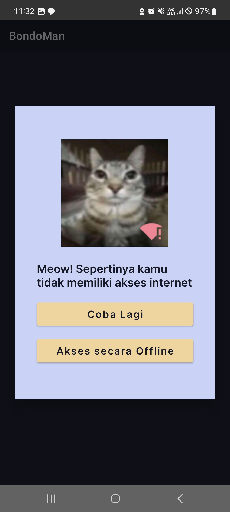

</td>

<td>

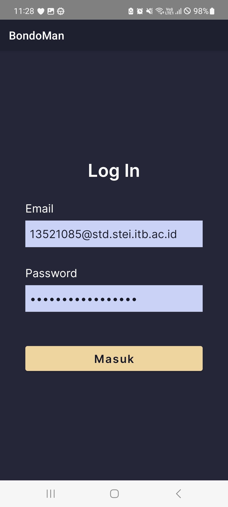

</td>

<td>

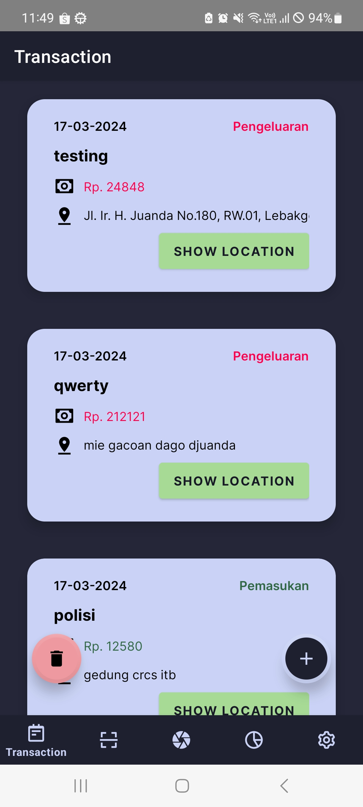

</td>

</tr>

<tr class="flex gap-2">
<td>

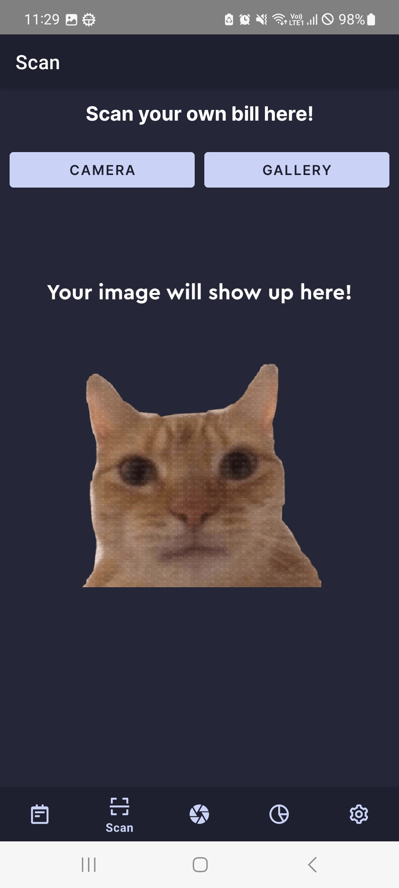

</td>
<td>

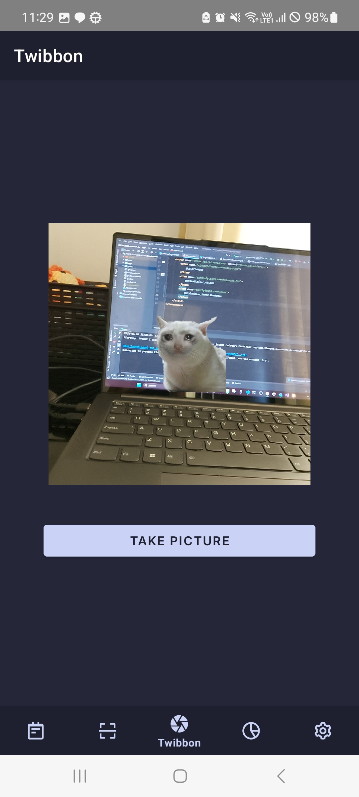

</td>
<td>

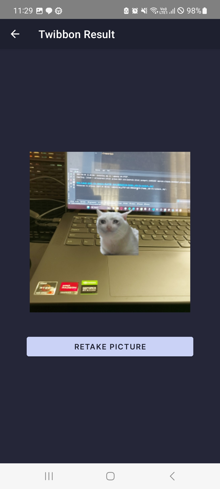

</td>
</tr>

<tr class="flex gap-2">
<td>

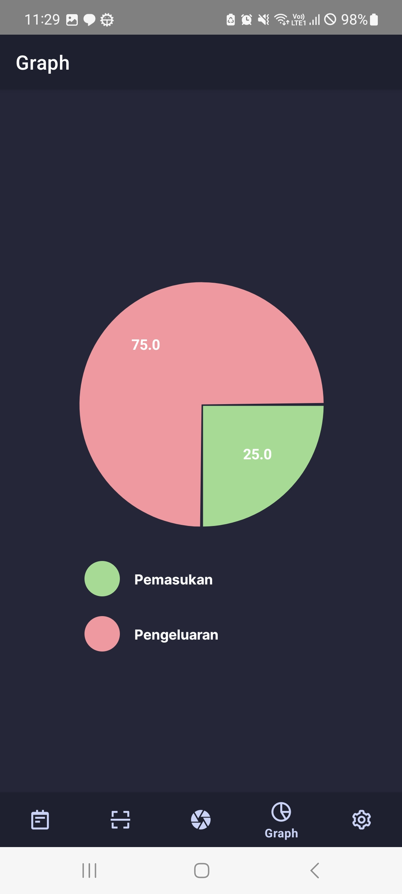

</td>
<td>

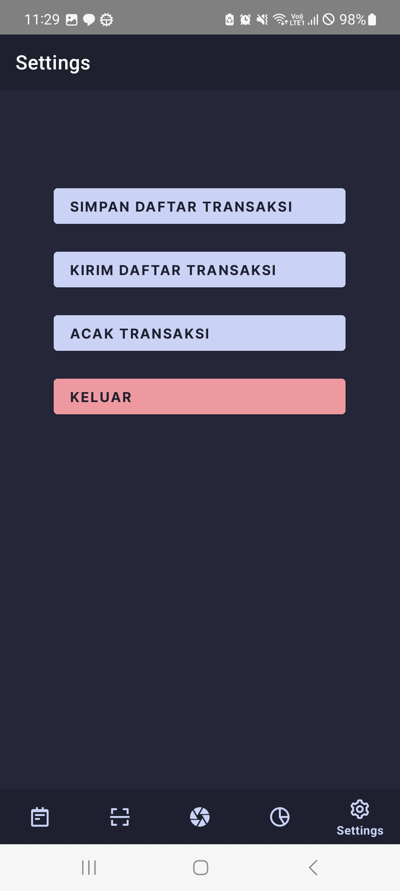

</td>
<td>

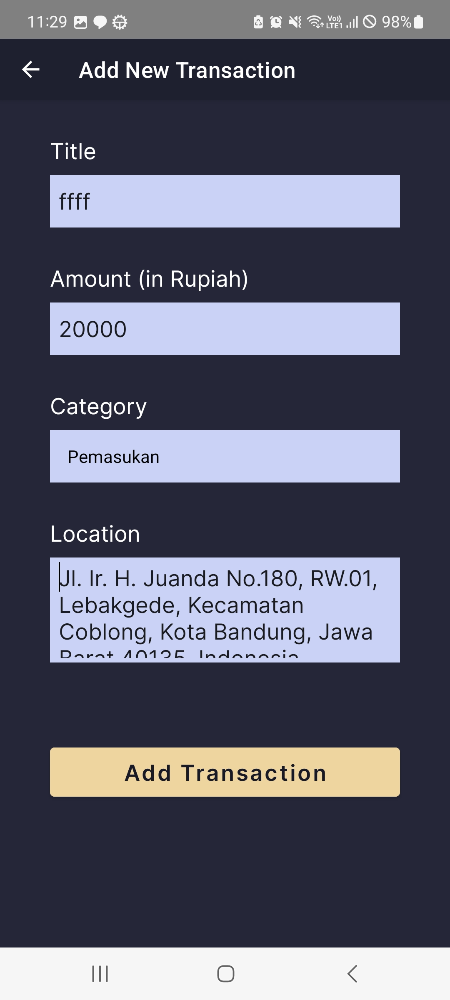

</td>
</tr>

<tr class="flex gap-2">
<td>

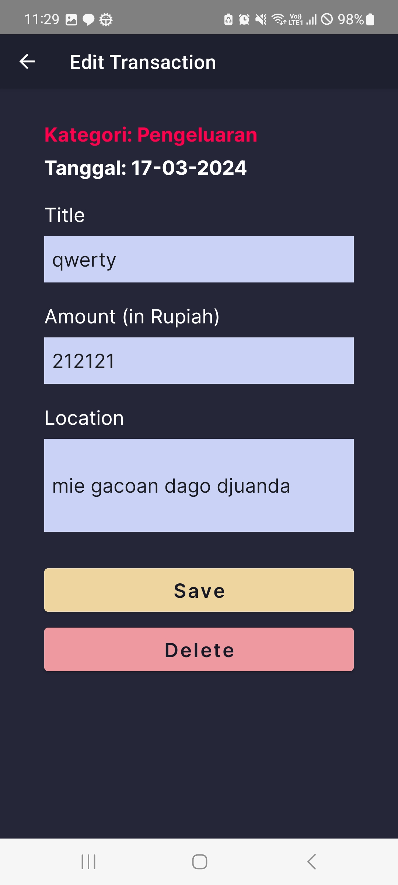

</td>
<td>

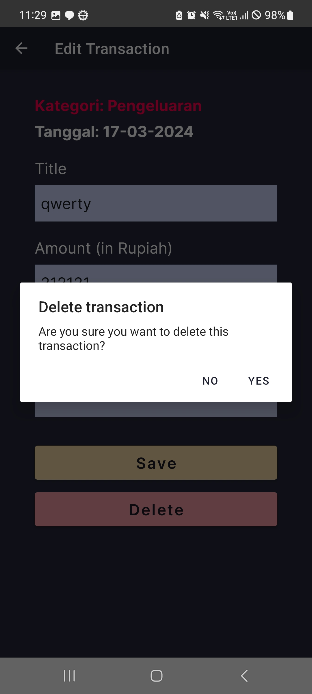

</td>
<td>

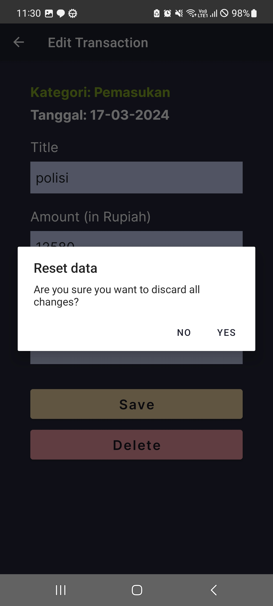

</td>
</tr>

<tr class="flex gap-2">
<td>

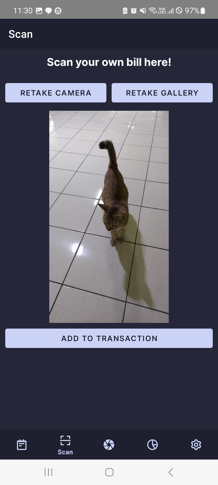

</td>
<td>

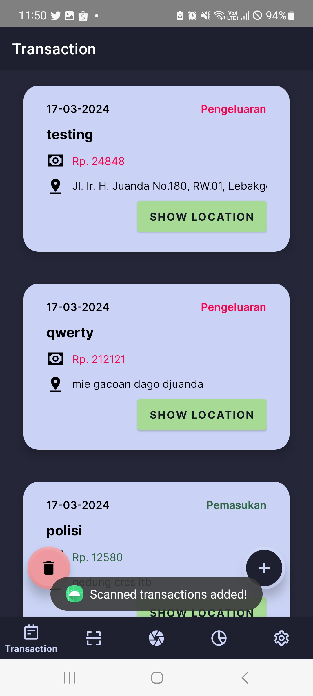

</td>
<td>

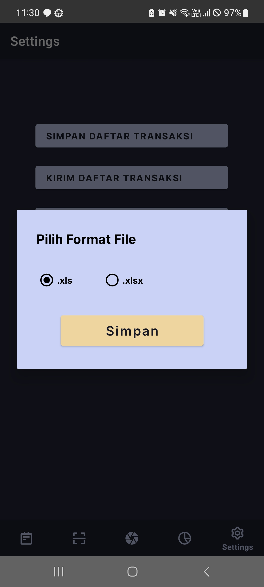

</td>
</tr>

<tr class="flex gap-2">
<td>

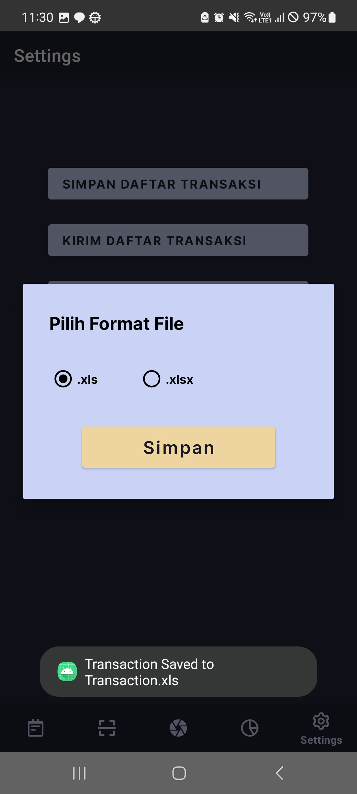

</td>
<td>

</td>
<td>

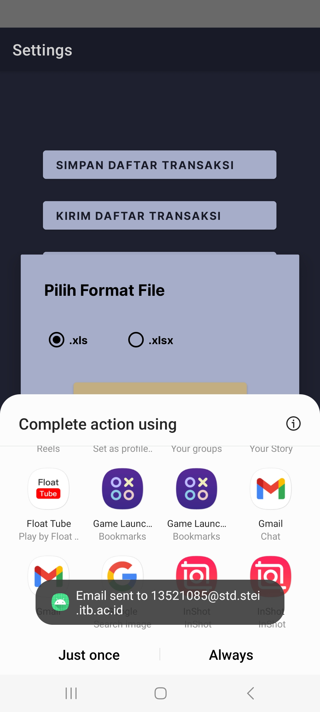

</td>
</tr>

<tr class="flex gap-2">
<td>

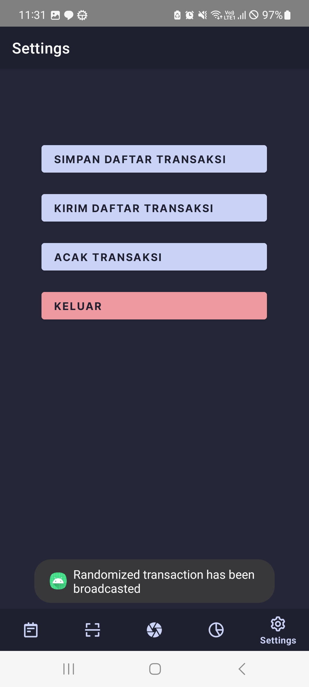

</td>
<td>

</td>
<td>

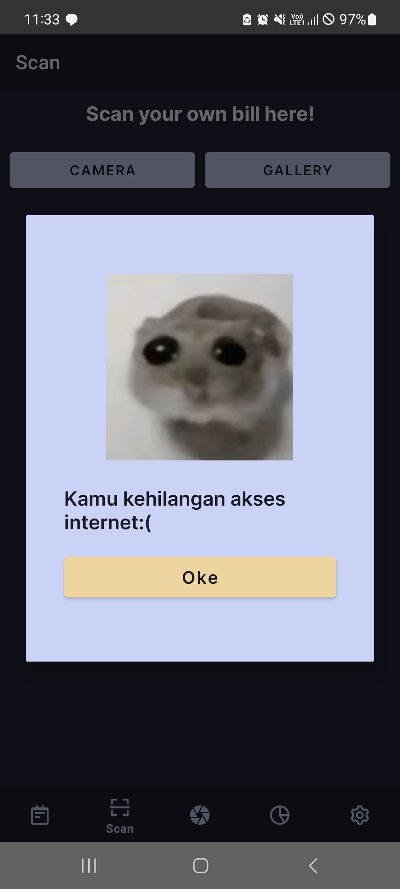

</td>
</tr>