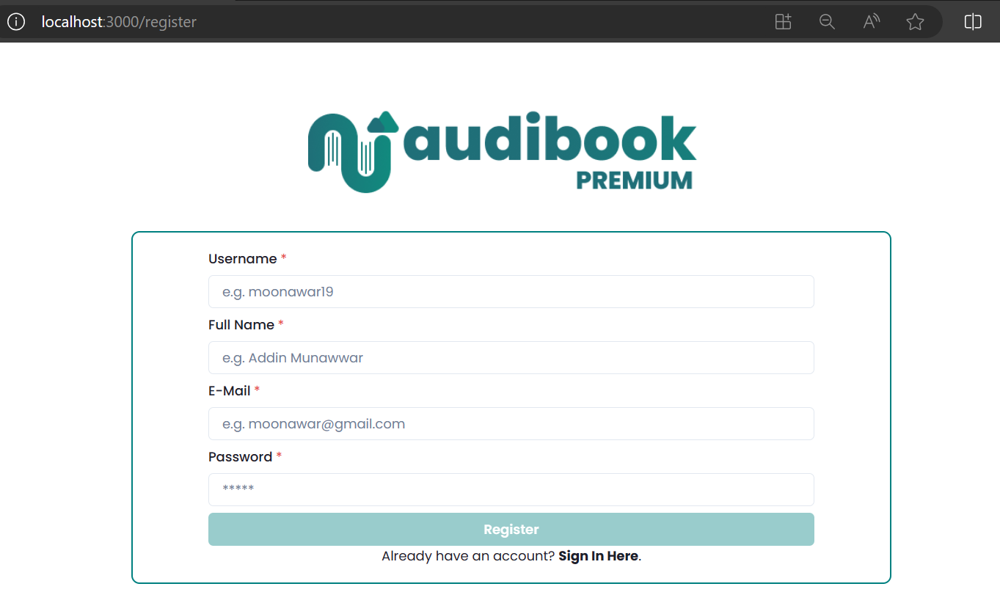
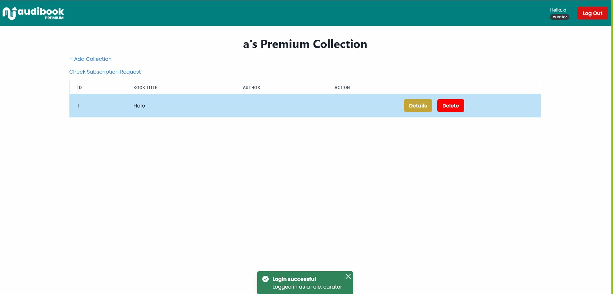

Github Parent Repository:  
https://github.com/cadevue/WBD-MonoRepo
 

# Project Description 
Audibook, a web application for audiobooks purchase and subscription, displaying both monolithic and microservice architecture. The project is built using monolithic architecture as base, and microservice for extension services (premium books and subscription). The services implementation are as follows:
1. Monolithic Base Application using PHP and MySQL.
2. Subscription service implementation using Java and Jax-WS with (SOAP protocol).
3. Premium Book service implementation using ExpressTS and MySQL (REST protocol).
4. Single Page Application for premium book service using ReactTS and Chakra UI.

All deployment are managed using Docker and Docker Compose.

# Monolithic Base
<a href="https://github.com/AJason36/PHP-ServiceApp-IF3110-2023-02-10/tree/945a1425dc46ded86074474e6d7882f7a38a0472" target="_blank" rel="noopener noreferrer">Github Repository</a>  

  

Audibook main website for managing audiobooks (admin) and purchasing audiobooks (user). Developed using PHP and MySQL.

<b>Feature Overview</b>
- Users can browse, search, and purchase audiobooks.
- Users can view detailed information for each audiobook.
- Admins can add, edit, and delete audiobooks.
- Admins can manage users and their accounts.
- Admins can manage supporting data such as genres and authors.

# Subscription Service
<a href="https://github.com/AJason36/SOAP-Service-IF3110-2023-02-10/tree/5df771ddc114a215789446d41c9ce739eb52c34e" target="_blank" rel="noopener noreferrer">Github Repository</a>  

Audibook Subscription Service provided by the Audibook platform, built using the SOAP protocol. The application is developed in Java with the JAX-WS library, Java Hibernate ORM, and MySQL Database. It also includes API Key authentication and a logging middleware.

<b>Feature Overview</b>
- Retrieve a list of curators subscribed to by a specific user.
- Create a subscription request from a user to a curator.
- Approve a user’s subscription request to a curator.
- Reject a user’s subscription request to a curator.
- Retrieve all incoming subscription requests for a curator.

# Premium Book Service

<a href="https://github.com/AJason36/REST-Service-IF3110-2023-02-10/tree/d73c5ad7bb4bc05f8704a2efdca7c546602aa730" target="_blank" rel="noopener noreferrer">Github Repository</a> 

Audi-REST is the backend service for the AudiBook platform—specifically supporting AudiBook Premium features. It is built using Express, TypeScript, and MySQL, and is fully containerized with Docker. The service integrates with the AudiBook SOAP Service for subscription-related operations.

<b>Feature Overview</b>
- User authentication and account management, including login, registration, and curator registration.
- Ability for users to retrieve their own profile information.
- Authors can create, update, and view their premium books, including detailed book information.
- Curators can create and manage their book collections, add or remove premium books, and view available premium content.
- Public endpoints to retrieve premium books and curator collections (via PHP routes).
- SOAP-integrated features allowing approval, rejection, and retrieval of premium subscription requests.

# AudiBook Premium App SPA

<a href="https://github.com/AJason36/Client-SPA_IF3110-2023-02-10/tree/7166b36e646736fd51092e2e33ea0900a93aa1c7" target="_blank" rel="noopener noreferrer">Github Repository</a> 

  

The frontend application for AudiBook Premium, designed for curators to manage subscription requests from AudiBook App users and for authors to manage their premium books. The application is built using React and TypeScript.

<b>Feature Overview</b>
- User login and registration.
- Add, edit, and view premium books (Author).
- Browse premium books and manage personal book collections (Curator).
- View all curator collections and book details.
- Review and handle subscription requests.
- Includes 404 and unauthorized pages.
