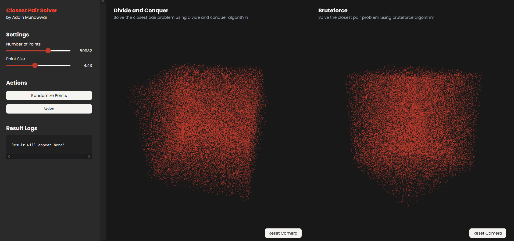
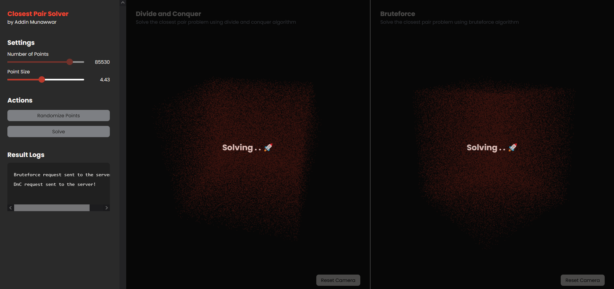
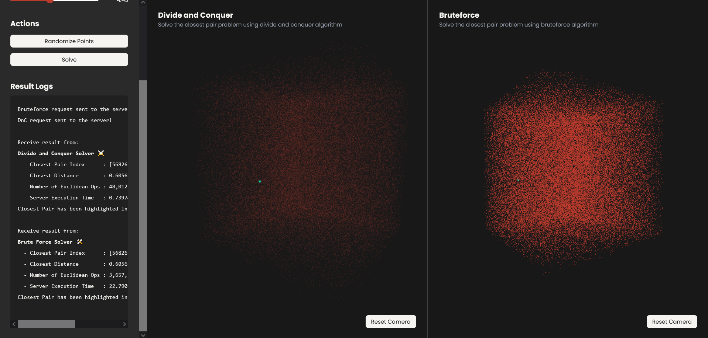
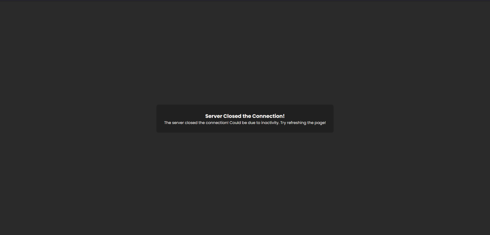

Github Repository: <br>
https://github.com/cadevue/closest-pair-solver
<br>

# Try Now!
This application can be tried out immediately! The web application can be accessed in this link: <br>
https://closest-pair-frontend.pages.dev/

<!-- # About This Project 
This project is made as part of my Computer Science Study at Bandung Institute of Technology. The specific course related to this project is IF2211 Algorithm Strategy.

This project was originally assigned at the 4th semester, but I decided to redo the entire project (February 2025) from learning purposes. 

The goal of my learning is to create a full web application, with the backend and frontend separated. The frontend and backend utilizes websocket for communication, as the closest pair problem can't be solved quickly, especially with the specification of the project (~ <b>10,000 to 100,000</b> points).

My goal for this project is also to learn about deployment, especially from the backend side. I write the backend using Golang, and deploy it using Docker inside an AWS EC2. I also implement a CI/CD pipeline using Github Actions that automatically build and deploy the backend, using the EC2 instance as the github-actions runner.

The original project can be found in this repository, which is just the algorithm implementation in Golang, without the frontend or server implementation: <br>
https://github.com/cadevue/ClosestPairSolver

*\* Notice that this differs from the repo of the current app. Repo of the current app can be found on top of this article*

I also want to credit the people who contributed in the original project:
- [Fakih Anugerah Pratama](https://github.com/fakihap/) -->


# Project Description 
A web application that solve the closest pair problem using 2 kind of algorithm — Brute Force and Divide and Conquer. The application shows the comparison between the two algorithms in terms of execution time and number of Euclidean operations needed to solve the problem.

The frontend is built using Typescript and Three.js, while the backend is built using Golang. The program is deployed using Cloudflare Pages (frontend) and Docker-AWS EC2 (backend). The communication between the frontend and backend is done using websocket.

Here is the specification of the request and response for the websocket communication:
```go
type SolveCPRequest struct {
	Method    string    `json:"method"`
	Dimension int32     `json:"dimension"`
	Points    []float64 `json:"points"`
}

type SolveCPResponse struct {
	Method            string   `json:"method"`
	Indexes           [2]int32 `json:"indexes"`
	Distance          float64  `json:"distance"`
	NumOfEuclideanOps int64    `json:"numOfEuclideanOps"`
	ExecutionTime     float64  `json:"executionTime"`
}
```

# Frontend
https://github.com/cadevue/closest-pair-frontend/tree/master

The technologies used for the frontend are:
- **Typescript** as the language
- **Three.js** for the 3D rendering of the points
- **Vite** for frontend bundling
- **TailwindCSS** for styling
- **JS Websocket** for the communication with the backend
- **Cloudflare Pages** for the deployment

# Backend
https://github.com/cadevue/closest-pair-backend/tree/master

The technologies used for the backend are:
- **Golang** as the language
- **Docker** for containerization
- **AWS EC2** for the deployment
- **Gorillaz Websocket** for communication with the frontend
- **Github Actions** for the CI/CD pipeline

# Deployment
The web application can be accessed in this link: <br>
https://closest-pair-frontend.pages.dev/

# Screenshots 
Here are some screenshots of the closest pair solver web application.

### Application Idle


### Solving the Closest Pair


### Result Visualization and Logs


### Connection Close when Idle
