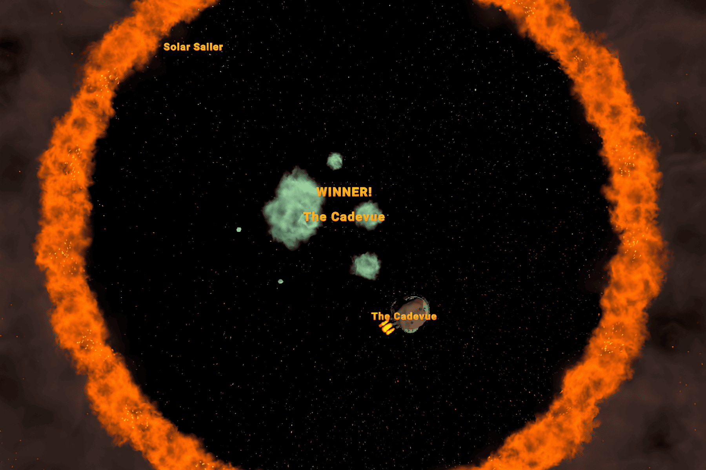

Github Repository:  
https://github.com/cadevue/galaxio-entelect-challenge
 

# Project Description 
A bot made for the Galaxio game from The [Entelect Challenge 2021](https://github.com/EntelectChallenge/2021-Galaxio). The bot is implemented in Java and follow the greedy algorithm paradigm. There are in total 8 states that the bot can be in:

1. &nbsp;**GatherFood**: The default state. The bot search around for food and fly towards them.
2. &nbsp;**GetSuperFood**: When there's a super food within certain radius, prioritize it over the normal food.
3. &nbsp;**TorpedoAttack**: When there's an enemy within the attack range and the player's size suffice to launch an attack, it will attack.
4. &nbsp;**StaySafe**: Based on the amount of danger (can be bigger enemies, gas clouds, or world boundaries), it will avoid those danger.
5. &nbsp;**UseShield**: If some amount of torpedo heading towards the player (with some degree tolearnce), it will activate the shield.
6. &nbsp;**PickUpSupernova**: Will be prioritized if there is a supernova pickup close enough to the player.
7. &nbsp;**FireSupernova**: Will be activated immediately if player successfully grab the supernova. Supernova will target the biggest enemy.
8. &nbsp;**DetonateSupernova**: After the supernova is fired, detonate the supernova it is within the radius of the target, and is far enough from the player.

Every state will have their own `State Score` based on the current game state (enemy positions, obstacle, current size, etc.). The state with the highest score will be chosen. This of course follows the greedy approach, where it picks the best solution based on the current situation only.

# Technology Used
The technologies used in this project are:
- **Java JRE 11** for the bot implementation
- **Dotnet Core 3.1** for the game engine
- **Microsoft SignalR** for server-client communication

# How to Run
Information about the engine and visualizer can be found in the [Galaxio-2021 Official Repo](https://github.com/EntelectChallenge/2021-Galaxio)!

*\* There are in total 5 things you should run: The engine and 4 bots. If you want to visualize the gameplay, then you have to run 1 more - the visualizer* 

### Prerequisites
- Java Runtime Environment (min. Java 11)
- Dotnet Core 3.1

### Run the Engine
1. &nbsp;Clone this repository with `recurse submodule` on. &nbsp;[Learn More](https://git-scm.com/book/en/v2/Git-Tools-Submodules)
2. &nbsp;In the project directory, run the `run_engine.bat` in the command prompt (Windows Only). 
3. &nbsp;Optionally, you can also run the `run.bat` or `run.sh` in the engine directory.

If successful, there will be 3 terminal open. Each terminal corresponds to: the engine, the runner, and the logger.

### Run the Bots
In the [latest release](https://github.com/cadevue/galaxio-entelect-challenge/releases/tag/v1.0.0), there are 2 bots you can use for the game: SolarSailers (The Old Bot) and TheCadevue (New Bot).

1. &nbsp;Download the zipped bot in the [latest release page](https://github.com/cadevue/galaxio-entelect-challenge/releases/tag/v1.0.0)!
2. &nbsp;Extract the zip!
3. &nbsp;Run the jar file inside the zip, e.g. `java -jar TheCadevue.jar`
4. &nbsp;Look at the engine/runner/logger if the bot registered successfully.

Galaxio will need 4 bots to run the game, so you can re-run another bot by repeating the step 3 and 4. You can, for example play the game with 2 SolarSailers bot and 2 TheCadevue bot.

### Visualizing the Game
The game will first be simulated in the terminal, and will generate logs that can be visualized. To visualize the game, you should run the visualizer. More about it in the [visualizer documentation](https://github.com/cadevue/galaxio-entelect-challenge-engine/blob/master/visualiser/README.md).

# Documentations
Here are some documentations of the galaxio bot in action.
### Three-Way Battle

### Using Shield

### Winner Winner Chicken Dinner!

 

The original bot (SolarSailers) was also being competed with other bots from student in the course class, and it actually got the 2️nd place! I got this mug as a prize:D
 

