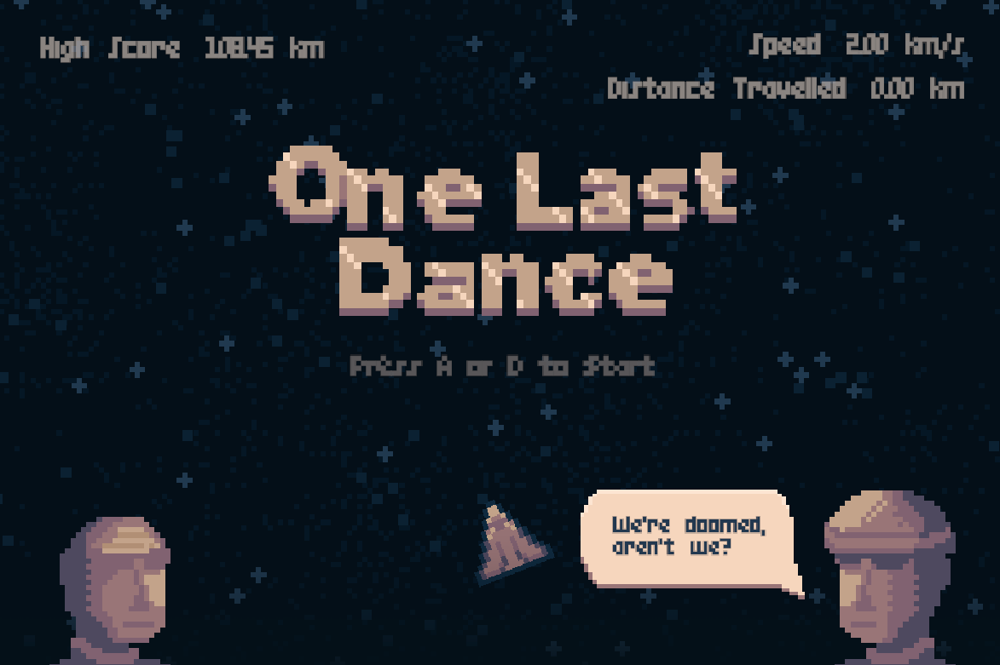
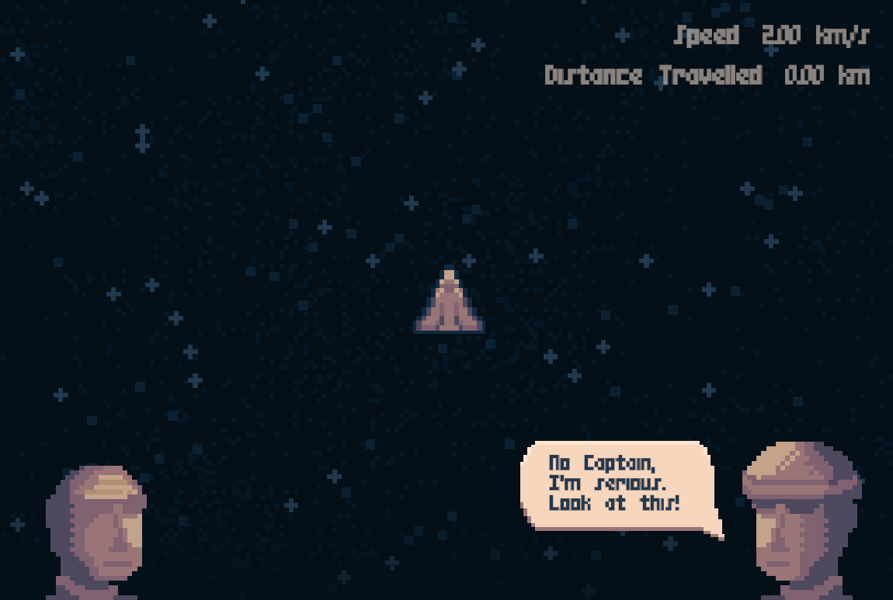
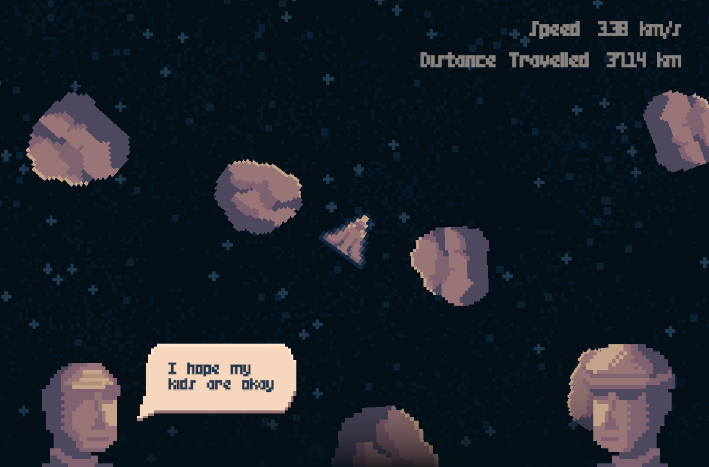

# Description
Two astronauts stranded in space inside the asteroid belt, facing their final fate. Between hope and despair, they perform their one last dance together, a dance of life and death.

This game was made for Solo Dev Game Jam #4 with the theme **'Two Button Controls'**.

<a href="https://moonawar.itch.io/one-last-dance" target="_blank" rel="noopener noreferrer">To Itch.io Page (Play in Browser)</a>
 

# Credits
This is part of Solo Dev Game Jam #4, so I did everything by myself! 

I did use some assets from the internet, which are listed below.
- Dialogue Blip from Pixabay
- Flashbang SFX from Pixabay
- Space Ambience from Freesound.org
- Stone Hit from Freesound.org
- Space BGM from Pixabay

For the tools, I used Unity as the game engine, Aseprite for the pixel art, and Audacity for audio editing.

# Game Screenshots
Here are some screenshots taken from the game.

 

 

 