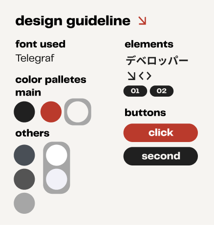
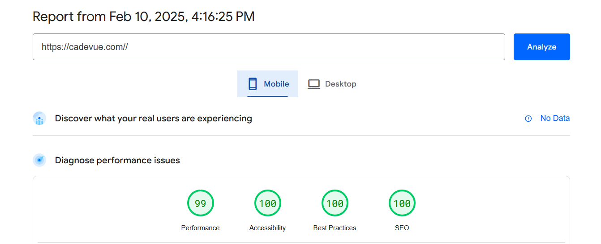
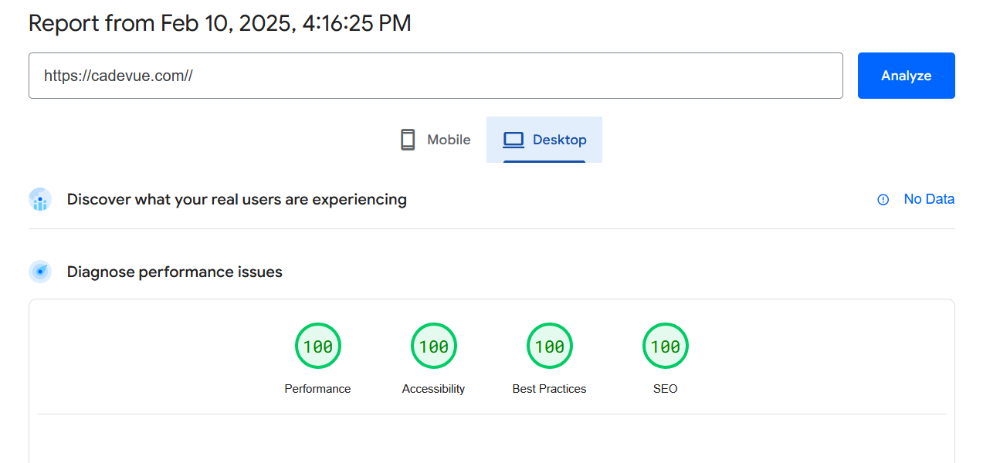

Github Parent Repository: <br>
https://github.com/cadevue/cadevue.com
<br>

# Project Description 
My Portfolio Website, Build using Astro Static-Site Generation. It's the website you're seeing right now:D. 

# The Design
This is the design guideline I made in Figma, although it's already changing (now it uses Monocraft-Poppins for fonts).
<br> <br>
<div class="flex flex-col items-center gap-1">



<br>
<span class="text-sm sm:text-base italic">Design Guideline for cadevue.com</span>
</div>
<br>

# Development and Deployment
Astro is a static site generator that can generate static sites from predefined html layout, and shipping it with minimal to no javascript. Astro also uses Vite in the background, which I think is the best build tools in the market right now. The thing I like the most about astro is probably its content management with Markdown. Deployment is managed with Cloudflare Pages.

# Optimization
### 1. Astro is Fast by Default
Astro is defaulted to ship no javascript. When needed, the javascript can be loaded lazily based on some rules. In my case, the rule is to load the javascript only when the element that uses it is in the viewport. Not only that, the javascript used is relatively small in size, because it's compiled to vanilla javascript by Svelte. Astro also handles memoization of javascript, so the javascript is only loaded once, and will not be loaded again even when the user navigates to another page.

### 2. Prefetching
Next, Astro also can prefetch the page that the user will likely to visit next. I use this feature all over my website. For the most part, in this website, the page will be fetched whenever the user hover over the link, so when the user actually click the link, the page is already there to be immediately served. 

### 3. SEO
For SEO, Astro also has a built-in sitemap generator. I can then submit the sitemap to google search console, so my website will be indexed by google.

### 4. Image Optimization
The built-in image optimization can't be used inside the Svelte (for future-proofing) component, so my solution is to host it in ImageKit. ImageKit also provides the transformation API as well, so I can resize the image based on the screen size. Here's an example of how I use it in my project page.

```html

```

<br>

# Result

<div class="flex flex-col items-center gap-1">



<br>
<span class="text-sm sm:text-base italic">Lighthouse score of cadevue.com (Mobile)</span>
</div>
<br>
<div class="flex flex-col items-center gap-1">



<br>
<span class="text-sm sm:text-base italic">Lighthouse score of cadevue.com (Desktop)</span>
</div>
<br>


