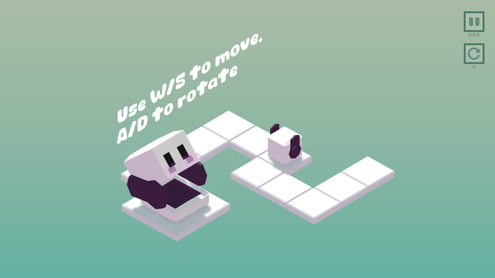
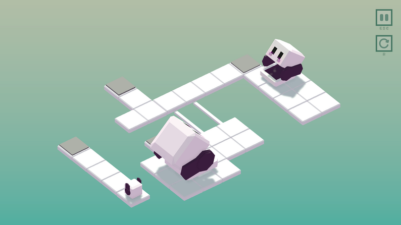
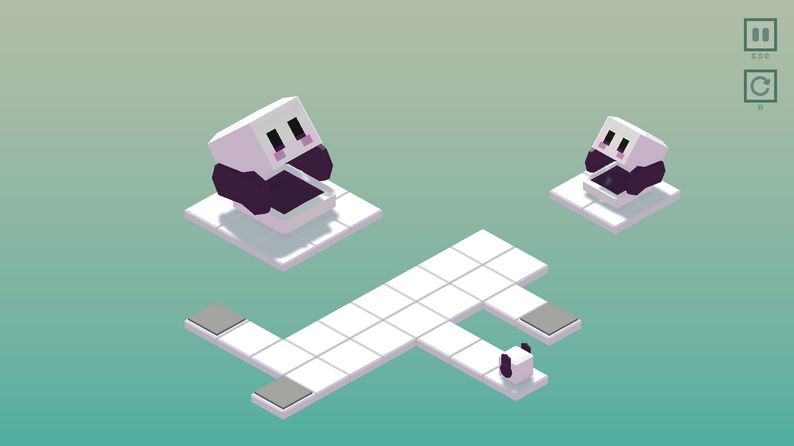
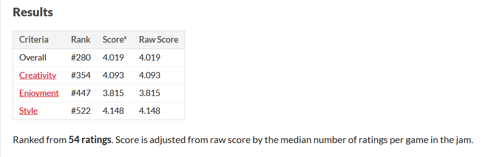

# Description
A puzzle game inspired by Matryoshka dolls. Help each Robushka to get inside their largest parent in this relaxing puzzle game. Hop in and out of different sized Robushkas to finish each level. 

This game was made for the GMTK Game Jam 2024 with the theme **'Built to Scale'**.

<a href="https://noart278.itch.io/robushka" target="_blank" rel="noopener noreferrer">To Itch.io Page (Play in Browser)</a>
  

# In Game Screenshots
Here are some screenshots taken from the game.

 

 

 

# Rank in GMTK Game Jam 2024

