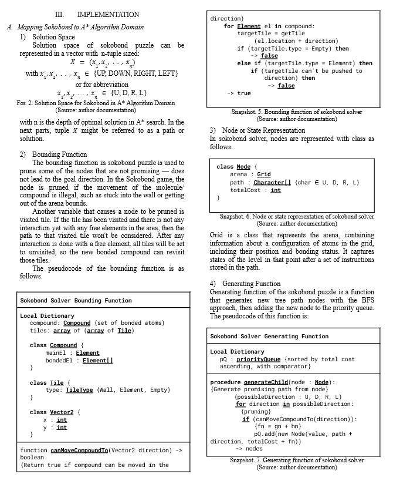
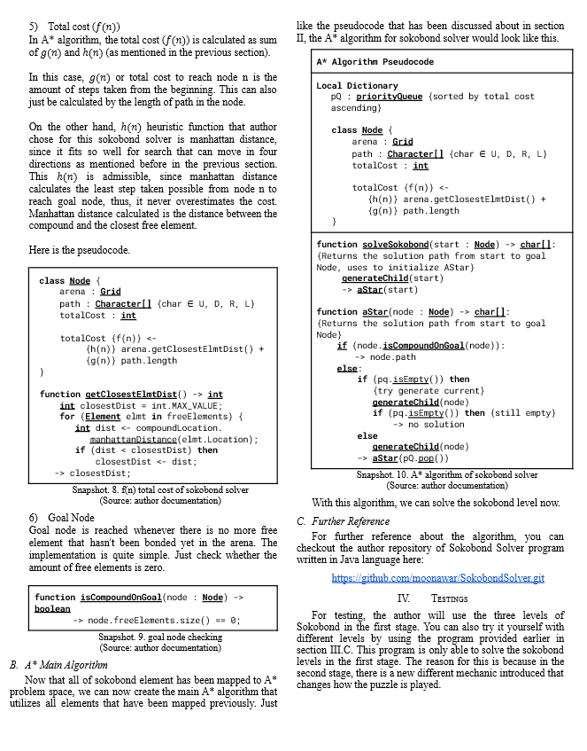
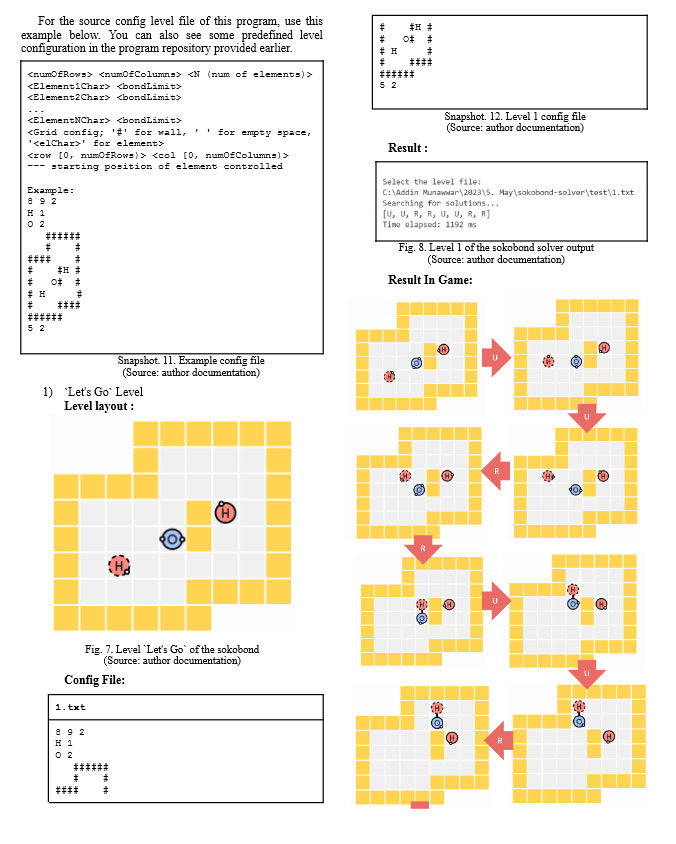

Github Repository: <br>
https://github.com/cadevue/WebGL-2D-Editor
<br>

I wrote a paper on this: <br>
[Access it Here](https://informatika.stei.itb.ac.id/~rinaldi.munir/Stmik/2022-2023/Makalah/Makalah-Stima-2023-(18).pdf)
<br>

# Description 👨‍💻
Sokobond Solver is a program written in Java intended to solve sokobond puzzle level. Sokobond is a puzzle game that revolves around the concept of chemical bonding. The game is played in a grid-based area where atoms are scattered throughout the environment. The goal is simple: arrange the atoms in such a way that it satisfies the chemical bonding rules. Sokobond game can be accessed from [Steam](https://store.steampowered.com/app/290260/Sokobond/).

# How to Run 🚀
1. Visit the [GitHub repository](https://github.com/cadevue/SokobondSolver.git) and clone the repository:
   ```bash
   git clone https://github.com/cadevue/SokobondSolver.git
   ```
2. Open a terminal in the application directory and enter the target directory:
   ```bash
   cd target
   ```

3. Run the program using the following command:
   ```bash
   java -jar SokobondSolver.jar
   ```

> *Check out the paper for implementation details.*

 <br>

 <br>

 <br>

# Contributors 🤝
&nbsp;Addin Munawwar Yusuf ([cadevue](https://github.com/cadevue))
