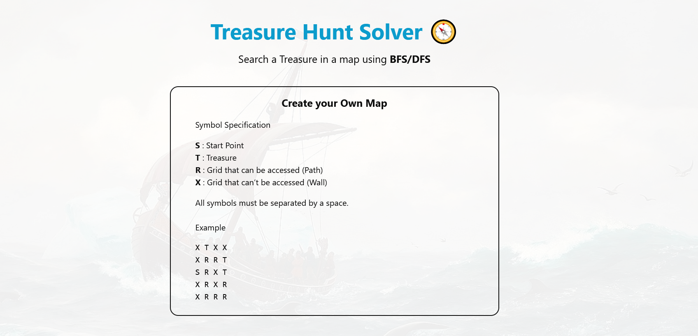
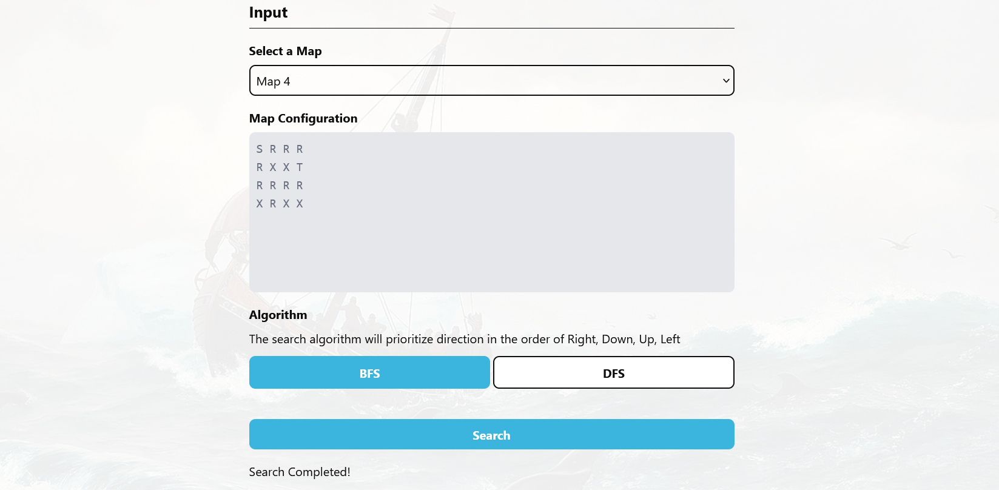
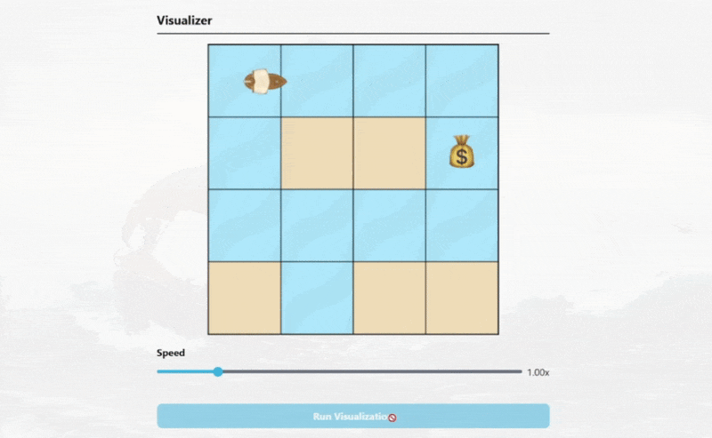

Github Repository:  
https://github.com/cadevue/treasure-hunt
 

# Try Now!
This application can be tried out immediately! The web application can be accessed in this link:  
https://treasure-hunt-lake.vercel.app/

<!-- # About This Project 
This project is made as part of my Computer Science Study at Bandung Institute of Technology. The specific course related to this project is IF2211 Algorithm Strategy. It focus specifically on the two searching algorithm: BFS and DFS.

This project is redone on February 20205. The original project can be found in this repository, which was implemented in C#:  
https://github.com/cadevue/TreasureHunt

*\* Notice that this differs from the repo of the current app. Repo of the current app can be found on top of this article*

I also want to credit the people who contributed in the original project:
- [Muhammad Bangkit Dwi Cahyono](https://github.com/bangkitdc/)
- [Louis Caesa Kesuma](https://github.com/Ainzw0rth/) -->

# Project Description 
A web application that solve the treasure hunt problem using Breadth First Search (BFS) and Depth First Search (DFS) algorithm. The application visualize how a ship traverse the ocean (grid-based) map to find the treasure using the two algorithms.

The technologies used for the application are:
- **React** as the frontend framework
- **Typescript** as the language
- **Vite** for the frontend bundler
- **TailwindCSS** for the styling
- **Vercel** for the deployment

# Deployment
The web application can be accessed in this link:  
https://treasure-hunt-lake.vercel.app/

# Screenshots 
Here are some screenshots of the treasure hunt application.

### Instruction

### Input Section

### Algorithm Visualization

### Result Summary
