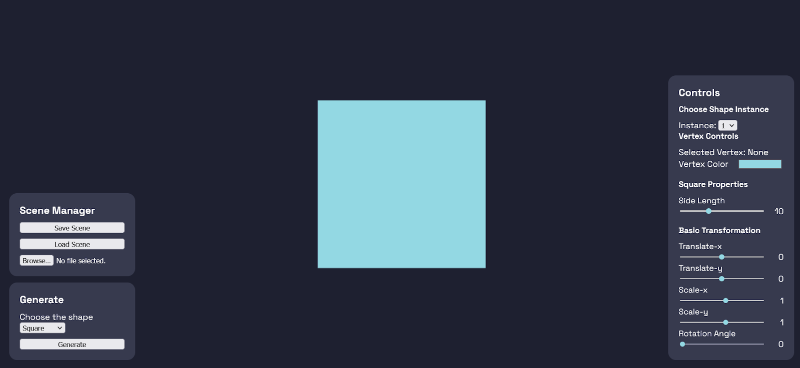
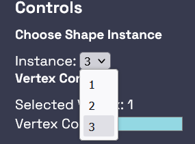
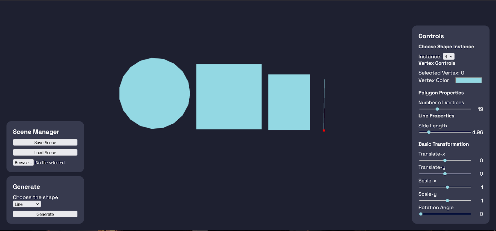
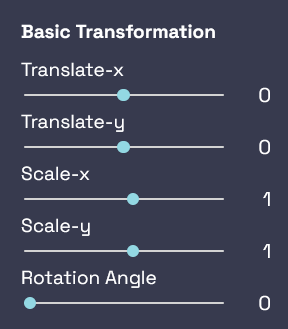
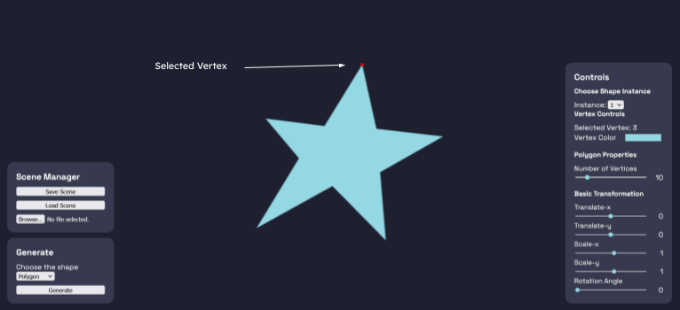
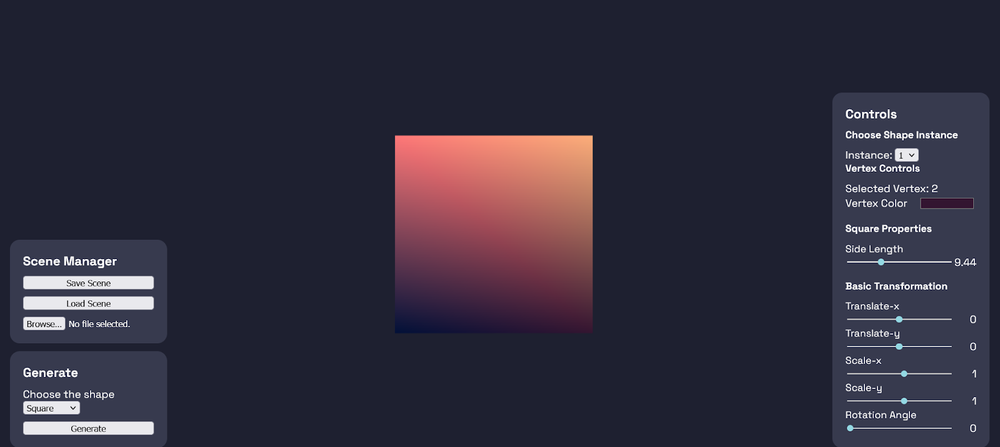
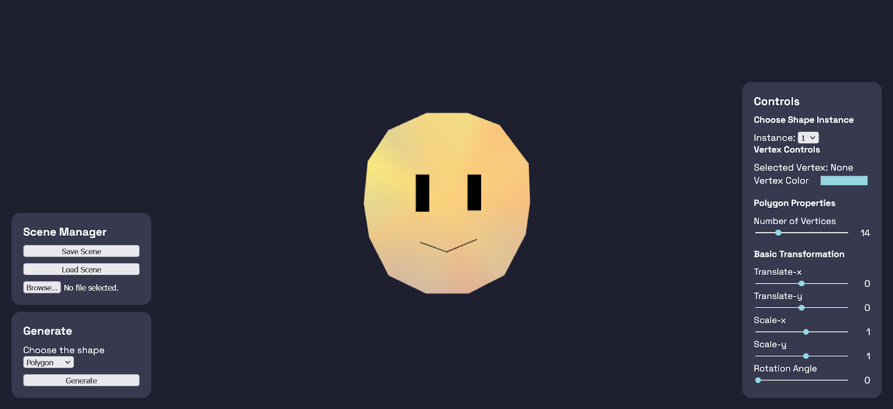
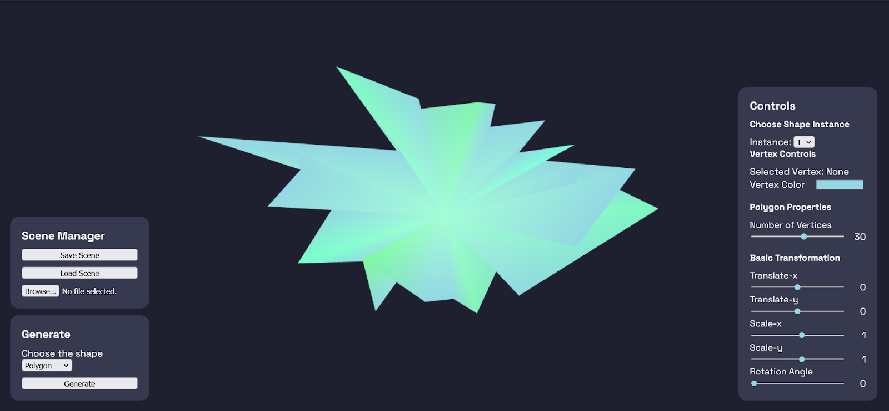
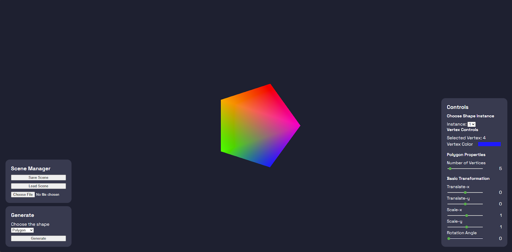
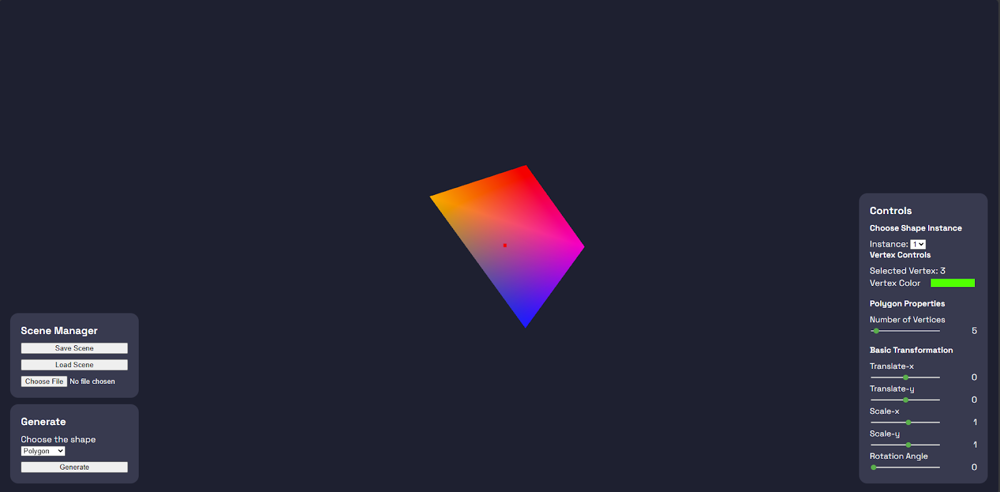

Github Repository: <br>
https://github.com/cadevue/WebGL-2D-Editor
<br>

# Description 👨‍💻
A web-based application that uses WebGL to draw and manipulate geometric models interactively. Users can create and edit lines, squares, rectangles, and polygons with basic transformations like translation, scaling, and rotation. Models can also be modified by dragging vertices and changing their colors. Created models can be saved, reloaded, and edited seamlessly.

# How to Run 🚀
1. Visit the [GitHub repository](https://github.com/cadevue/WebGL-2D-Editor) and clone the repository:
   ```bash
   git clone https://github.com/cadevue/WebGL-2D-Editor
   ```
2. Open a terminal in the application directory.

   ```bash
   npm install
    npm run dev
   ```

3. The application will run at http://localhost:3000/, or other port as specified in the terminal.

# Features ✨
## Basic Drawing
You can draw basic elements using the Generate controls located at the bottom left of the screen. Select the desired shape from the dropdown menu, then click the `generate` button to create it.


Once an object is created, the control panel on the right updates based on the selected object’s functionalities.
The first control group is Choose Shape Instance, which allows you to select which object instance to edit when multiple objects are present in the scene.


Next is the Shape Properties control group, which lets you edit properties specific to each type of geometry:
- **Line**: Adjust the line’s length.
- **Square**: Adjust the side length.
- **Rectangle**: Adjust the width and height.
- **Polygon**: Add or remove sides (vertices).




## Geometric Transformations
There are three basic transformations available for each model: translation, scaling, and rotation.
All transformations are performed relative to the world origin, located at the center of the screen. This is because the transformation matrices are calculated on the client side, but vertex matrix multiplication happens on the GPU via shaders. As a result, transformations do not directly update the object's world coordinates.


All geometry transformations can be accessed through the Basic Transformation controls on the right side of the screen.
Available controls include:
- Translation along the X-axis
- Translation along the Y-axis
- Scaling along the X-axis
- Scaling along the Y-axis
- Rotation around the Z-axis (perpendicular to the screen)

## Vertex Manipulation
Each model's vertices can be moved with specific behaviors:
    - For squares and rectangles, vertex movement preserves the original shape (a square remains a square).
    - For lines and polygons, vertex movement is freeform, allowing the creation of entirely new shapes.


To move an object's vertices, the object must first be selected as the active instance through the Choose Shape Instance menu.
To change a vertex’s color, first select the desired vertex.
Then, use the Vertex Color controls on the right panel to choose a new color for the selected vertex.


## Save and Load
Scenes can be saved and loaded through the Scene Manager on the left side of the screen.
- Press Save Scene to download a scene.json file, which can be loaded later.
- To load a scene, upload the file through the Scene Manager and press Load Scene.

Two demo scenes, `smile.json` and `crystal.json`, are available in the GitHub repository.






## Convex Hull
Every manipulated vertex position will maintain the convex hull of the object. The convex hull is a polygon that encloses all vertices of the object, and it will be updated every time a vertex is moved. This feature is useful for visualizing the object's shape and ensuring that it remains convex.

Before Transformation


After Transformation


# Contributors 🤝
1. &nbsp;Addin Munawwar Yusuf ([cadevue](https://github.com/cadevue))
2. &nbsp;Naufal Syifa Firdaus ([nomsf](https://github.com/nomsf))
3. &nbsp;Louis Caesa Kesuma ([Ainzw0rth](https://github.com/Ainzw0rth))