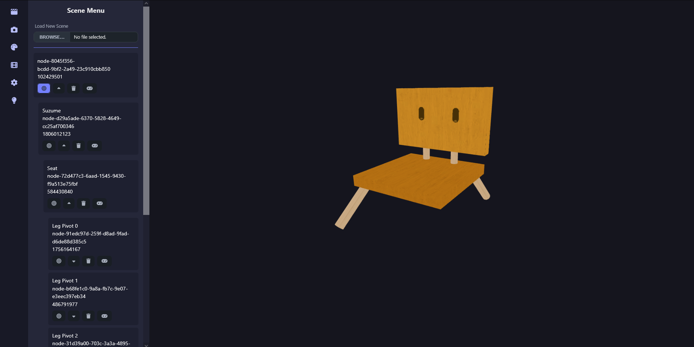
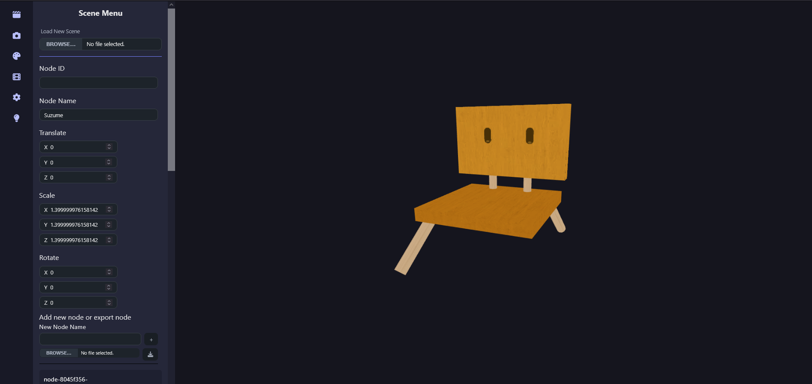
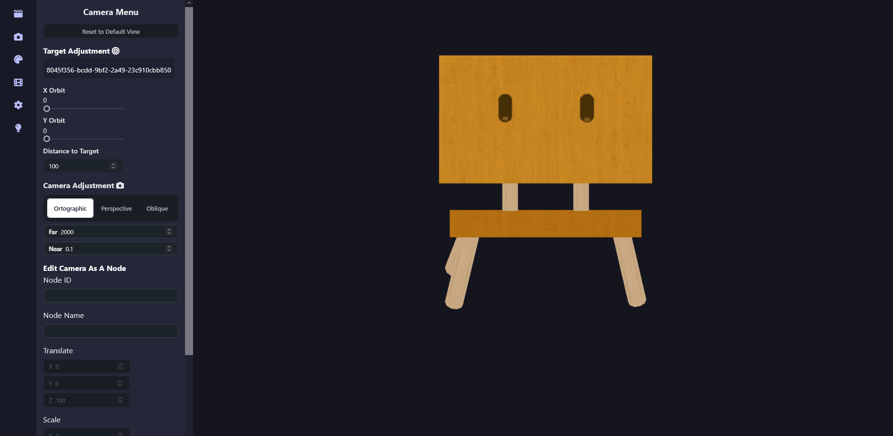
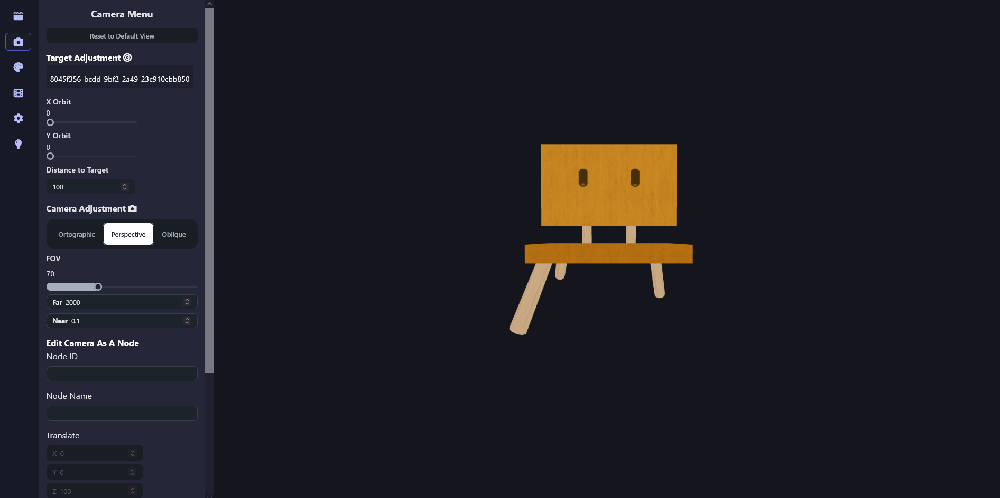
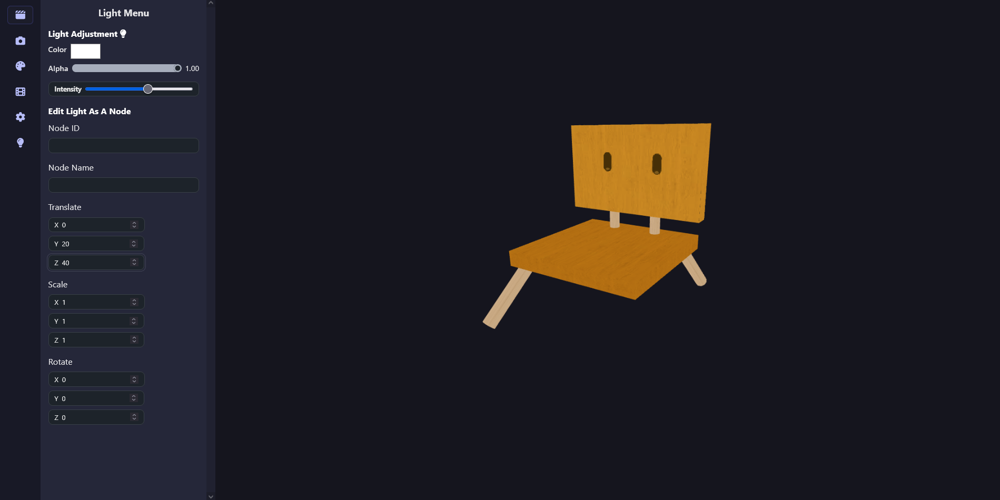
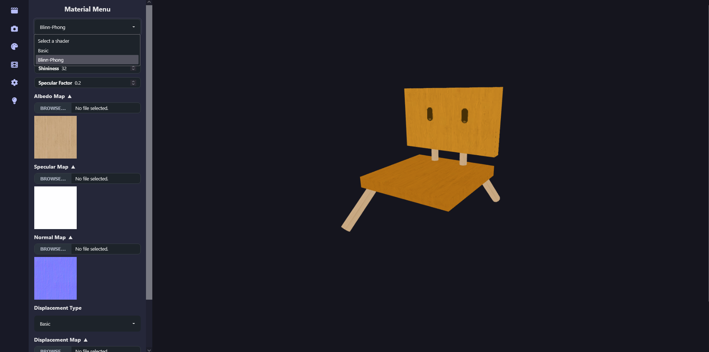
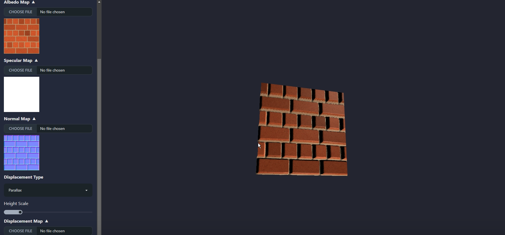
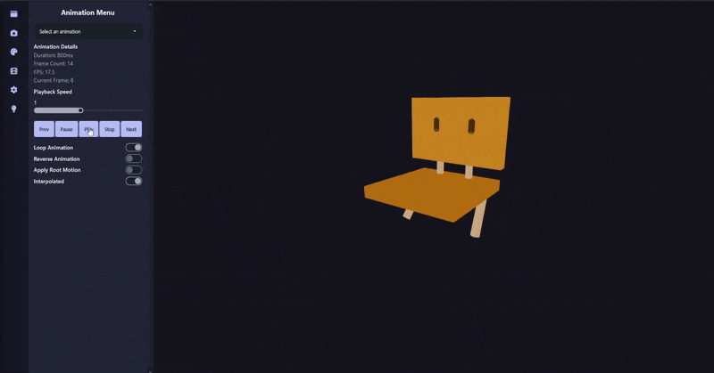

Github Repository:  
Private

# Description 👨‍💻
A web-based application that uses WebGL to draw and manipulate geometric models interactively. Users can create and edit lines, squares, rectangles, and polygons with basic transformations like translation, scaling, and rotation. Models can also be modified by dragging vertices and changing their colors. Created models can be saved, reloaded, and edited seamlessly.

# How to Run 🚀
This repository is private, so you can't run it locally for now. Here's the demo we made on the project though (Indonesian Only):
1. [Component Editor](https://www.loom.com/share/0baffab481934da09023bd2b82ea9524)
2. [Scene](https://www.loom.com/share/2aff15bba6f448d88f9667ffc37833f8)
3. [Camera](https://www.loom.com/share/61575364a5194dadbec0cd617310d34f)
4. [Materials and Animation (Me)](https://www.loom.com/share/f08ae8e3bde04085bdf92de0acc2844f)
5. [Light](https://www.loom.com/share/5e83ee54aa9d483ea9227f15d1114a67)
6. [Character Controller](https://www.loom.com/share/6a7fe2eabe174a48a7f4d720ceacfc9a)
7. [Parallax Map and Tweening (Me)](https://www.loom.com/share/4cf99099fa004ff6b78bf50fcc08561a)

# Features ✨
## Component Editor
A component editor to add, remove, and edit objects and the scene graph. The component editor is located on the left side of the screen. It contains a list of all objects in the scene. 

Upon selecting an object in the scene graph, the component editor also allows you to edit the properties of each object, such as its position, rotation, and scale.

## Camera
Edit the camera properties, such as its position, rotation, and field of view. If target is specified, the camera position and rotation can also be updated by its orbit and distance. There are three camera projections available: orthographic, perspective, and oblique.

Orthographic Projection:

Perspective Projection:

## Light
There is one directional light source available in the scene. This properties can be edited in the light editor, such as its color, intensity, and direction.

## Materials
Upon selecting an object, go to the material editor to edit the material properties, such as its color, texture, and shininess. There is 2 type of shaders, which is Basic (Unlit/won't react to the light), and Blinn-Phong (Lit/will react to the light). The materials are set in a PBR style, which includes albedo map, specular map, normal map, and displacement map.

There is also an option to do displacement using parallax mapping, which is a technique to create the illusion of depth in a 2D texture by using a height map.

## Animation
Animation is defined in a json file and can be played in the scene. Select an object with animation and you can control the playback in the animation editor.

Any other stuff can be seen as in the demo.

# Contributors 🤝
1. &nbsp;Addin Munawwar Yusuf ([cadevue](https://github.com/cadevue))
2. &nbsp;Fatih Nararya R.I. ([Fatih20](https://github.com/Fatih20))
3. &nbsp;Hosea Nathanael Abetnego ([HoseaNA](https://github.com/HoseaNA))
4. &nbsp;Muhammad Zaydan Athallah ([zaydanA](https://github.com/zaydanA))