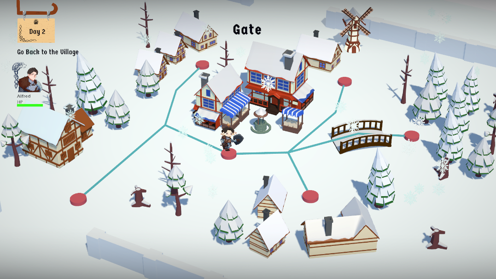

# Description
**Winterbear** is a Story-driven Card Battler Adventure game where player unveils the truth behind a winter curse while slowly overcoming each characters hardship. Keep yourself warm in this pitiful adventure through loneliness. and keep your friends warmer.

# Credits
This game is made by 5 people, including me. The team members are:
- M. Rafli Zamzami as Programmer & Project Manager
- Addin Munawwar (Me) as Programmer
- Fadhlirrahman Hilmi as 3D Artist
- Vanny Aprilia as 2D Artist
- Fedora Tantono as 2D Artist

# Pitch Deck
You can access the pitch deck [here](https://www.canva.com/design/DAGNasE2iEA/FO0hyKrlPpy3zCxS9uNz4w/edit).

# Trailer
https://www.instagram.com/p/DAdnEUctnTW/

# Game Screenshots
Here are some screenshots taken from the game.

 

 

